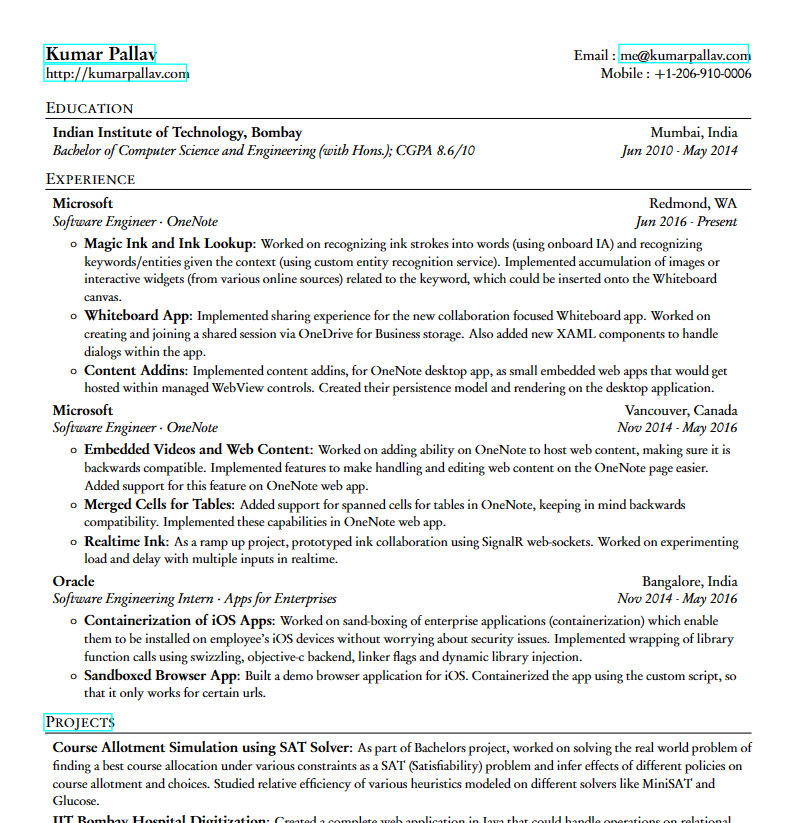

# Sharelatex resume tempalte

Thanks from the [template](https://www.overleaf.com/articles/kumar-pallavs-one-page-resume/cqtggyfbyrdk)

Here made Chinese support and some format changes.



## How to use

```bash
# windows
$ xcopy .\data\ .\_data\
```

Then Up these files to a new folder and change the compiler to LualaTeX.
